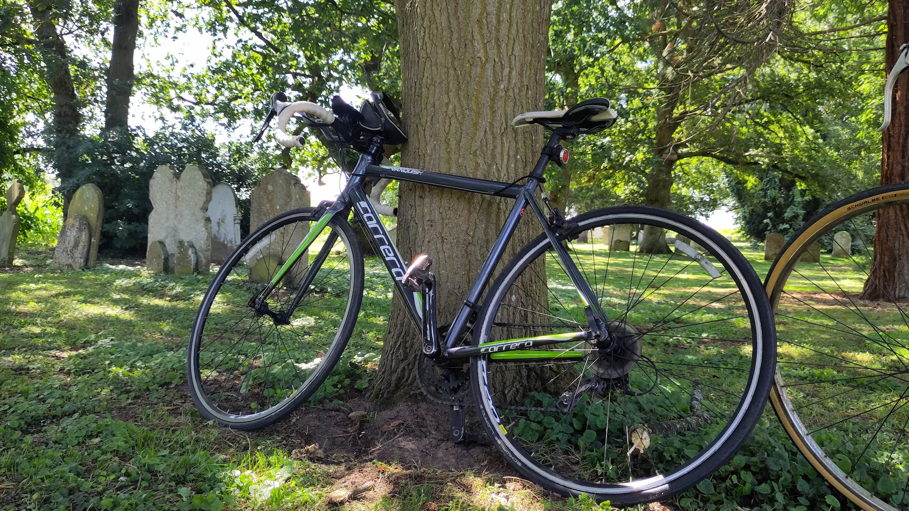

##

After the short pub ride the other week, I wanted to have a go at a longer ride. Nothing huge — just a simple way to test how I’d handle more time in the saddle.

<!--more-->

## The Route

I had been getting excited about this ride, so I planning out four possible routes: two around 15 miles, and two closer to 30, all with café stops as a goal. 

But after eating out the night before, we decided to switch things up and pack a picnic instead. We settled on a 25 km loop (about 15 miles). Hopefully we would be able to find a nice scenic place around halfway to stop for lunch.

## The ride and picnic

The weather couldn’t have been better: sunny, warm, and perfect for cycling. The route itself was mostly flat, with a few hills thrown in to keep things interesting. Those climbs were tough and definitely tested my stamina, but the promise of a picnic break kept us motivated.

*Our bikes at our picnic lunch stop.*

The picnic halfway was a highlight — nothing fancy, just some reduced sandwiches we got from Morrisons. We managed to find a nice grassy patch next to a quiet church. But we didn't stop for too long and we were off - the second half flew by once we’d eaten.

## Fitness, Feeling, and Goals

I’d expected more knee trouble, but managed better than I thought. The ride felt decently long, but the hills were tough — they drained my legs quickly and showed me how far I’ve got to go. I’m hoping my knees keep improving, and I’d love to get faster — hopefully get up to a  15 mph (24 kmh) average in the future.

## Gear Thoughts

I’m definitely underprepared on gear. Everything just went into a rucksack, and I don’t even have a bottle holder yet. Not ideal, but it worked for now. Before tackling longer rides, I’ll need to sort out some basics: bottle cage, pannier rack (or something), and maybe some snacks.

## Conclusion and Next Steps

By the end of the ride we were shattered, and after a busy day, we slept hard that evening. It was a good day, and a little confidence boost. My knees held up, the distance didn’t break me, and I enjoyed it. Next up: pushing towards something closer to 30 miles, improving my average speed, and upgrading my gear.
