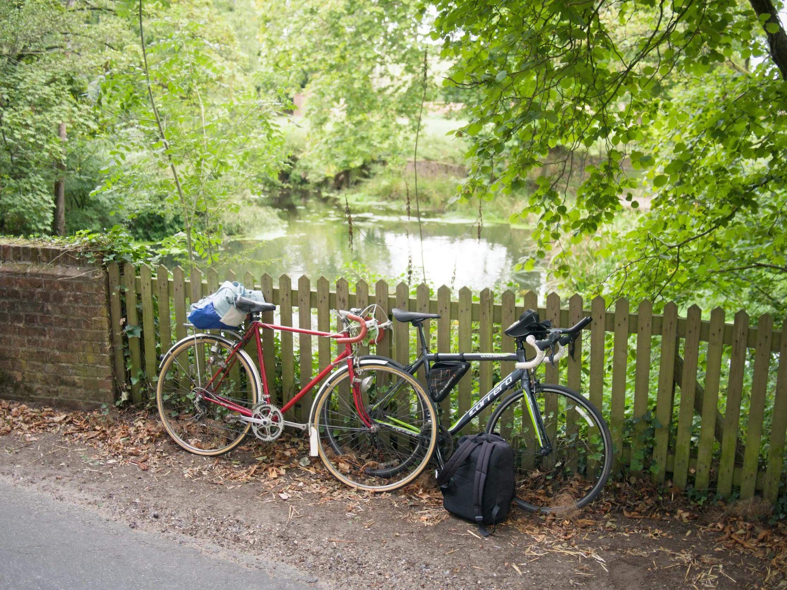

We're upping our distance to 2 x 30 mile cycles in 1 weekend. 

It was actually 3 days due to bank holiday Monday. But still, this was double our longest ride, but done twice. It was a big step up.

## The Route

As usual I was planning multiple routes on the days coming up to this. I had 4 routes to 3 different cafes (1 scenic route), and a direct route, which we'll probably take on the way back.

We decided on one of them, being 30.7 miles (49.4 km), to our top pick of the cafes. But, the night before I noticed a cafe update - they we're closed for a week... gutted. We switched plans and decided on the scenic ride to another cafe.

This meant we an extra 3 miles (4.8 km). This was the new route:

|||
| :----------- | :----------- |
| **Distance**      | 33.7 mile (54.2 km)       |
| **Elevation Climb**   | 220m         |
| **Elevation Difference**   | -30m         |
| **Steepest Climb**   | 8.6%       |
| **Est. Time**   | 3 hr 23 mins       |

|||
| :----------- | :----------- |
| **Distance**      | 30 mile (52 km)       |
| **Weather**   | Light clouds with some sun         |
| **Knees**   | Not bad at all         |
| **Destination goal**   | Just make it + get coffee       |
| **Morale**   | Good - Tired - Worried about the return       |